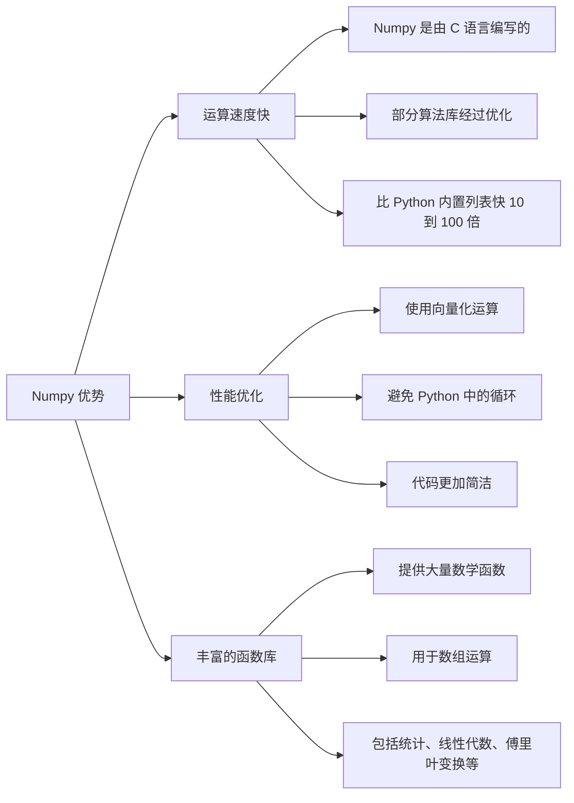
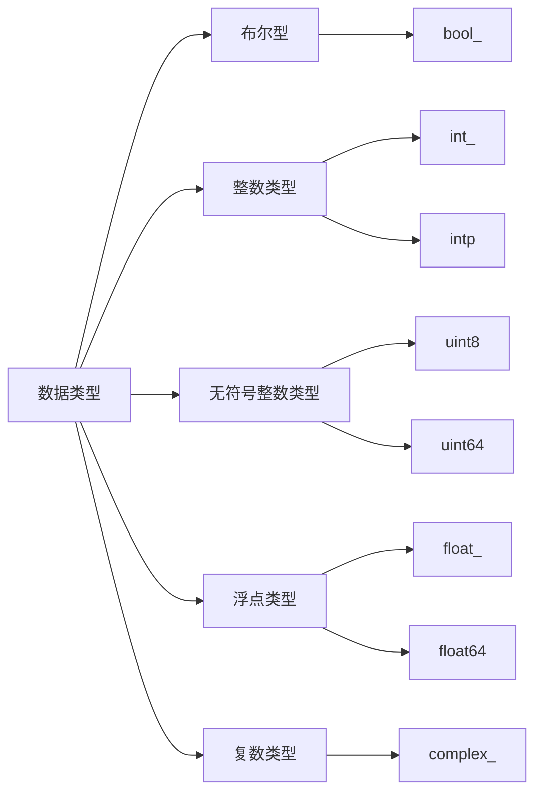
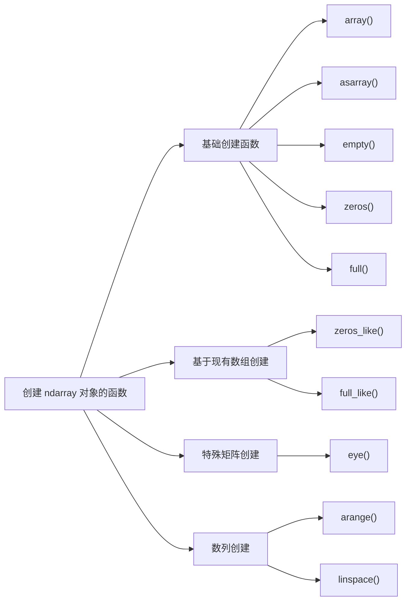
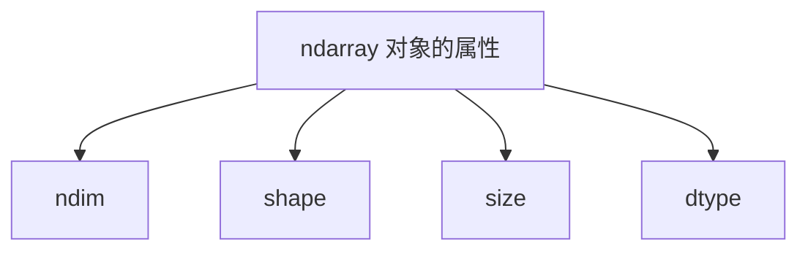
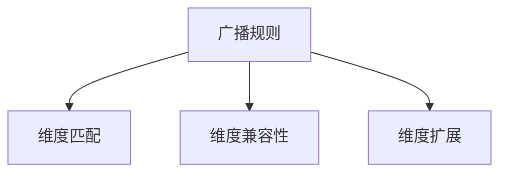

# Numpy for Python

> [!Note]
> 参考网址：
>
> - Numpy 官方中文文档：[https://www.numpy.org.cn/]
> - Numpy 简单入门：[https://numpy123.com/]

## 一、Numpy 简介

### 1. Numpy 的作用

Numpy 是 Python 的一个科学计算库，支持大量的维度数组与矩阵计算，也提供了高性能的多维数组对象以及相关工具。Numpy 是 Scipy、Pandas 等数据处理或科学计算库的基础。

简单来说，Numpy 就是一个运行速度非常快的数学计算库，主要用于数组计算。它的核心是 ndarray 对象，这个对象是一个 N 维数组，也就是多维数组。另外，Numpy 还提供了许多广播功能函数，整合了 C/C++/Fortran 代码的工具，可以用来存储和处理大型矩阵。并提供了线性代数、傅里叶变换、随机数生成等功能，可以说 Numpy 是 Python 科学计算的基础库。

Numpy 具有如下优势：

1. 运算速度快：Numpy 是由 C 语言编写的，所以 Numpy 的部分算法库经过优化，可以提供快速的数学运算。对于同样的运算任务，使用 Numpy 比使用 Python 内置的列表要快 10 到 100 倍以上。
2. 性能优化：Numpy 在内部使用了向量化运算，这样可以避免 Python 中的循环，使得代码更加简洁，同时运行速度更快。
3. 丰富的函数库：Numpy 提供了大量的数学函数，可以用于数组的运算，包括统计、线性代数、傅里叶变换等。



Numpy 通常与 Scipy（科学计算库）、Matplotlib（绘图库）和 Pandas（数据处理库）一起使用，这些库都是基于 Numpy 开发的。这些库的组合构成了一种功能强大的科学计算环境。

### 2. ndarray 对象

Numpy 的核心是 ndarray 对象，它是一个 N 维数组对象，也称为多维数组。ndarray 对象是一个快速而灵活的大数据集容器，可以容纳多个相同类型的元素。

- ndarray 对象是一系列 `相同类型的数据` 集合，可以是任意维度的。
- ndarray 对象中的每个元素在内存中都有相同大小的区域。
- ndarray 对象中的索引从 0 开始。

> [!Important]
> Numpy 默认 ndarray 对象中的所有元素类型都是相同的，这一点有别于 Python 列表（list）。如果在创建 ndarray 时传入不同类型的数据，Numpy 会自动将数据类型转换为同一类型，以保证数组中所有元素类型一致，其优先级为：`bool` < `int` < `float` < `str`。

## 二、创建 ndarray 对象

### 1. 数据类型

要创建 ndarray 对象，首先要知道它支持哪些数据类型。

Numpy 提供了比 Python 内置类型更丰富和高效的数据类型，以支持更复杂的数值计算需求。下面简要介绍了一些常见的 Numpy 数据类型：

|    数据类型    |                       描述                       |
| :--------: | :--------------------------------------------: |
|  `bool_`   |            布尔型数据类型，仅包括 True 和 False            |
|   `int_`   | 默认整数类型，类似于 C 语言中的 long，通常为 int32 或 int64，取决于平台 |
|   `intp`   |  用于索引的整数类型，类似于 C 中的 ssize_t，一般为 int32 或 int64  |
|  `uint8`   |             8 位无符号整数，取值范围为 0 到 255             |
|  `uint64`  |    64 位无符号整数，取值范围为 0 到 18446744073709551615    |
|  `float_`  |       默认浮点类型，为 float64 的别名，通常用于更精确的浮点数表示       |
| `float64`  |      双精度浮点数（64 位）：包含 1 位符号、11 位指数和 52 位尾数      |
| `complex_` |   默认复数类型，为 complex128 的别名，使用 64 位浮点数表示实部和虚部    |



这些数据类型，在 Numpy 中称为 `dtype` 对象，它们支持高效的数值计算，使 Numpy 成为科学计算和数据处理中的重要工具。

在实际使用中，Numpy 支持使用标识数据类型的字符代码来使得数据类型的定义更加简洁。以下是常用的字符代码以及对应的数据类型：

| 字符代码 | 数据类型 |
| :---: | :---: |
| `b` | 布尔型（bool） |
| `i` | 有符号整型（int） |
| `u` | 无符号整型（unsigned int） |
| `f` | 浮点型（float） |
| `c` | 复数浮点型（complex） |
| `m` | 时间间隔（timedelta） |
| `M` | 日期时间（datetime） |
| `O` | Python 对象（object） |
| `S` | 字符串（string） |
| `U` | Unicode 字符串（unicode string） |
| `V` | 原始数据类型（void），用于定义固定大小的原始数据块 |

在 Numpy 中，我们还可以自定义 `dtype` 对象，以实现更灵活的数据类型定义。`dtype` 对象包含了数据类型的元数据，如数据类型名称、数据大小、字节顺序等。我们可以使用 `dtype` 对象指定数据类型，以便在创建数组时使用。使用 `np.dtype()` 函数创建 `dtype` 对象，它接受一个列表，列表中的每个元素是一个元组，元组的格式为：`(字段名称, 数据类型)`。例如，我们可以创建一个包含整数和浮点数字段的自定义数据类型：

```python
import numpy as np

# 定义包含整数和浮点数的结构
custom_dtype = np.dtype([('age', np.int32), ('height', np.float32)])
```

在上面的例子中，自定义的数据类型 `custom_dtype` 包含两个字段：

- age：`np.int32` 类型的整数字段
- height：`np.float32` 类型的浮点数字段

### 2. 创建 ndarray 对象的常见函数

在 Numpy 中，有如下常用的创建 ndarray 对象的函数：



#### (1) 基础创建函数

1. `array()` 函数

我们可以使用 `array()` 函数从列表、元组等 Python 序列类型创建 ndarray 对象。该函数的语法如下：

```python
numpy.array(object, dtype=None, copy=True, order=None, subok=False, ndmin=0)
```

参数说明：

- `object`：传入的 Python 序列类型，如列表或元组。
- `dtype`：数据类型（可选）。如果不指定，Numpy 会自动推断合适的数据类型。
- `copy`：布尔值（可选）。若为 `True`（默认），会创建新对象；若为 `False`，则直接引用现有对象。
- `order`：顺序（可选），创建数组的样式。C 行优先（行方向）、F 列优先（列方向）、A 任意方向（默认）。
- `subok`：布尔值（可选）。默认为 `False`，返回基础类数组；若为 `True`，返回子类数组。
- `ndmin`：指定生成数组的最小维度（可选）。

下面是一些创建 ndarray 对象的示例：

示例 1：从列表创建 `ndarray` 对象

::code-mirror-run{:editable="true" maxHeight="20rem" :showInCol="true"}

```python
import numpy as np

# 使用列表创建 ndarray 对象
arr = np.array([1, 2, 3, 4])
print(arr)
print(type(arr))
```

::

示例 2：`ndarray` 对象中的元素类型一致

```python
# 即使提供的数据类型不一致，Numpy 会自动转换为单一类型
arr_mixed = np.array([1, 2.5, 3, 4.7])
print(arr_mixed)
print(arr_mixed.dtype)

# 输出
# [1.  2.5 3.  4.7]
# float64
```

示例 3：创建多维 `ndarray` 对象

::code-mirror-run{:editable="true" maxHeight="20rem" :showInCol="true"}

```python
# 创建二维数组
  multi_dim_arr = np.array([[1, 2, 3], [4, 5, 6]])
  print(multi_dim_arr)
  print("数组维度:", multi_dim_arr.ndim)
```

::

示例 4：使用 `dtype` 参数指定数据类型

```python
# 使用 dtype 指定数据类型为 float
arr_float = np.array([1, 2, 3], dtype=np.float32)
print(arr_float)
print(arr_float.dtype)

# 输出
# [1. 2. 3.]
# float32
```

示例 5：自定义 `dtype` 对象，并使用它创建 `ndarray` 对象

::code-mirror-run{:editable="true" maxHeight="20rem" :showInCol="true"}

```python
# 自定义 dtype 包含一个整数和一个浮点数字段
custom_dtype = np.dtype([('age', np.int32), ('height', np.float32)])
arr_custom = np.array([(25, 5.9), (30, 6.1)], dtype=custom_dtype)
print(arr_custom)
print(arr_custom['age'])
print(arr_custom['height'])
```

::

通过这些示例，我们可以看到 `array()` 函数在 Numpy 中提供了强大的灵活性，使得创建多样化的数据结构变得更加简便。

2. `empty()` 函数、 `zeros()` 函数与 `full()` 函数

除了使用 `array()` 函数和 `asarray()` 函数，我们还可以使用 `empty()` 函数和 `zeros()` 函数来创建 ndarray 对象。这两个函数通常用于创建指定形状的数组，但不会初始化数组元素。

- `empty()` 函数创建一个指定形状的数组，当数组元素为随机值，因为它们未初始化。
- `zeros()` 函数创建一个指定形状的数组，所有元素值均为为 0。

它们的语法如下：

```python
# empty() 函数
numpy.empty(shape, dtype=float, order='C')

# zeros() 函数
numpy.zeros(shape, dtype=float, order='C')
```

参数说明：

- `shape`：数组形状，可以是整数或整数元组。如 5 表示一维数组，(2, 3) 表示二维数组，其中 2 表示行数，3 表示列数。
- `dtype`：数据类型（可选）。如果不指定，Numpy 会自动推断合适的数据类型。
- `order`：顺序（可选），创建数组的样式。C 行优先（行方向）、F 列优先（列方向）。

下面是一个使用 `empty()` 函数和 `zeros()` 函数创建数组的示例：

::code-mirror-run{:editable="true" maxHeight="20rem" :showInCol="true"}

```python
import numpy as np

# 使用 empty() 函数创建一个 2x3 的未初始化数组
empty_array = np.empty((2, 3))
print("使用 empty() 函数创建的数组:\n", empty_array)

# 使用 zeros() 函数创建一个 2x3 的全零数组
zeros_array = np.zeros((2, 3))
print("使用 zeros() 函数创建的数组:\n", zeros_array)
```

::

> [!Note]
> 除了 `zeros()` 函数，Numpy 还提供了 `ones()` 函数，用于创建指定形状的全 1 数组。`ones()` 函数的语法与 `zeros()` 函数相同，只是使用 1 来初始化数组元素。

如果想要更灵活地初始化数组元素，可以使用 `full()` 函数，它可以指定初始化数组元素的值。其语法如下：

```python
numpy.full(shape, fill_value, dtype=None, order='C')
```

参数说明：

- `shape`：数组形状，可以是整数或整数元组。
- `fill_value`：初始化数组元素的值。
- `dtype`：数据类型（可选）。如果不指定，Numpy 会自动推断合适的数据类型。
- `order`：顺序（可选），创建数组的样式。C 行优先（行方向）、F 列优先（列方向）。

下面是一个使用 `full()` 函数创建数组的示例：

```python
import numpy as np
# 使用 full() 函数创建一个 2x3 的数组，所有元素值为 5
full_array = np.full((2, 3), 5)
print("使用 full() 函数创建的数组:\n", full_array)

# 输出
# 使用 full() 函数创建的数组:
# [[5 5 5]
# [5 5 5]]
```

#### (2) 基于现有数组创建

除了 `empty()` 函数、`zeros()` 函数、`ones()` 函数和 `full()` 函数，Numpy 还提供了 `zeros_like()` 函数和 `full_like()` 函数，用于创建与指定数组形状相同的全 0 数组和全指定值数组。这两个函数的语法如下：

```python
# zeros_like() 函数
numpy.zeros_like(a, dtype=None, order='K', subok=True)

# full_like() 函数
numpy.full_like(a, fill_value, dtype=None, order='K', subok=True)
```

参数说明：

- `a`：输入的数组，用于指定新数组的形状。
- `fill_value`：初始化数组元素的值。
- `dtype`：数据类型（可选）。如果不指定，Numpy 会自动推断合适的数据类型。
- `order`：顺序（可选），创建数组的样式。C 为行优先（行方向）、F 为列优先（列方向）、K 为保持输入数组的内存布局顺序。
- `subok`：布尔值（可选）。默认为 `True`，返回子类数组；若为 `False`，返回基础类数组。

下面是一个使用 `zeros_like()` 函数和 `full_like()` 函数创建数组的示例：

::code-mirror-run{:editable="true" maxHeight="20rem" :showInCol="true"}

```python
import numpy as np

# 创建一个示例数组
a = np.array([[1, 2, 3], [4, 5, 6]])

# 使用 zeros_like() 函数创建一个与 a 形状相同的全零数组
zeros_like_a = np.zeros_like(a)
print("与 a 形状相同的全零数组:\n", zeros_like_a)

# 使用 full_like() 函数创建一个与 a 形状相同的全 7 数组
full_like_a = np.full_like(a, fill_value=7)
print("与 a 形状相同的全 7 数组:\n", full_like_a)
```

::

## 三、ndarray 对象的属性

Numpy 数组的维数称为数组的秩（rank），一维数组的秩为 1，二维数组的秩为 2，以此类推。数组的形状称为数组的维度（dimension），每一个维度就是一个轴（axis）。例如，一个二维数组的第一个轴的长度就是数组的行数，第二个轴的长度就是数组的列数。

Numpy 数组对象 ndarray 有以下几个重要的属性：



- `ndarray.ndim`：数组的维数（秩），表示数组的轴数。例如，二维数组的 `ndim` 为 2，三维数组的 `ndim` 为 3。

```python
import numpy as np
a = np.array([[1, 2, 3], [4, 5, 6]])
print(a.ndim)

# 输出
# 2
```

- `ndarray.shape`：数组的形状，返回一个元组，表示数组在每个维度上的大小。对于 `n` 行 `m` 列的二维数组，`shape` 返回 `(n, m)`。

```python
print(a.shape) # 输出：(2, 3)
```

- `ndarray.size`：数组中元素的总数，等于 `shape` 元组中所有维度大小的乘积。即对于形状为 `(2, 3)` 的数组，`size` 为 `2 * 3 = 6`。

```python
print(a.size) # 输出：6
```

- `ndarray.dtype`：数组中元素的数据类型，例如 `int32`、`float64` 等。

```python
print(a.dtype) # 输出：int64
```

以上就是 ndarray 对象的常用属性，这些属性可以帮助我们更好地理解数组的结构和特性。

## 四、数组运算

### 1. 多维数组的运算

Numpy 提供了许多数学函数，用于对数组进行数学运算。下面我们主要介绍两类：

- 算术函数：用于执行基本的算术运算，如加法、减法、乘法和除法。
- 三角函数：用于执行三角函数运算，如 sin、cos 和 tan。

#### (1) 算术函数

Numpy 提供了许多算术函数，用于执行基本的算术运算，如加法、减法、乘法和除法。下面是一些常用的算术函数：

- `add()`：用于执行加法运算。
- `subtract()`：用于执行减法运算。
- `multiply()`：用于执行乘法运算。
- `divide()`：用于执行除法运算。
- `power()`：用于执行幂运算。

下面是这些算术函数的示例，首先我们需要定义两个用来演算的数组：

::code-mirror-run{:editable="true" maxHeight="20rem" :showInCol="true"}

```python
import numpy as np

# 定义两个数组用于演示
array1 = np.array([10, 20, 30, 40])
array2 = np.array([2, 4, 5, 8])
```

::

1. 加法运算：add()，逐元素将 array1 和 array2 相加

::code-mirror-run{:editable="true" maxHeight="20rem" :showInCol="true"}

```python
result_add = np.add(array1, array2)
print("加法运算结果:", result_add)
```

::

2. 减法运算：subtract()，逐元素将 array2 从 array1 中减去

::code-mirror-run{:editable="true" maxHeight="20rem" :showInCol="true"}

```python
result_subtract = np.subtract(array1, array2)
print("减法运算结果:", result_subtract)
```

::

3. 乘法运算：multiply()，逐元素将 array1 与 array2 相乘

```python
result_multiply = np.multiply(array1, array2)
print("乘法运算结果:", result_multiply)

# 输出
# 乘法运算结果: [ 20  80 150 320]
```

4. 除法运算：divide()，逐元素将 array1 除以 array2，得到浮点数结果

```python
result_divide = np.divide(array1, array2)
print("除法运算结果:", result_divide)

# 输出
# 除法运算结果: [5. 5. 6. 5.]
```

5. 幂运算：power()，逐元素将 array1 的元素作为底数，array2 的元素作为指数

```python
result_power = np.power(array1, array2)
print("幂运算结果:", result_power)

# 输出
# 幂运算结果: [          100        160000      24300000 6553600000000]
```

#### (2) 数学函数

Numpy 包含大量的数学函数，用于执行各种数学运算。下面介绍两个常用的数学函数：求和函数 `sum()` 和舍入函数 `around()`。

1. `sum()` 函数

`sum()` 函数用于计算数组中元素的总和。它的语法如下：

```python
numpy.sum(a, axis=None, dtype=None, keepdims=False)
```

参数说明：

- `a`：输入的数组。
- `axis`：指定计算的轴。如果为 `None`，则计算所有元素的总和；如果为整数，则计算指定轴的和；如果为元组，则计算指定的多个轴的和。
- `dtype`：数据类型（可选）。如果不指定，Numpy 会自动推断合适的数据类型。
- `keepdims`：布尔值（可选）。若为 `True`，则保持输出数组的维度。

下面是一个使用 `sum()` 函数计算数组元素总和的示例：

::code-mirror-run{:editable="true" maxHeight="20rem" :showInCol="true"}

```python
import numpy as np

# 创建一个二维数组
a = np.array([[1, 2, 3], [4, 5, 6]])

# 计算所有元素的总和
total_sum = np.sum(a)
print("所有元素的总和:", total_sum)

# 计算每一列的总和
column_sum = np.sum(a, axis=0)
print("每一列的总和:", column_sum)

# 计算每一行的总和
row_sum = np.sum(a, axis=1)
print("每一行的总和:", row_sum)
```

::

2. `around()` 函数

`around()` 函数用于将数组中的元素四舍五入到指定的小数位数。它的语法如下：

```python
numpy.around(a, decimals=0)
```

参数说明：

- `a`：输入的数组。
- `decimals`：指定小数位数。默认为 0，表示将元素四舍五入到整数。

下面是一个使用 `around()` 函数将数组元素四舍五入到指定小数位数的示例：

::code-mirror-run{:editable="true" maxHeight="20rem" :showInCol="true"}

```python
import numpy as np

# 创建一个包含浮点数的数组
a = np.array([1.123, 2.456, 3.789, 4.101])

# 将数组元素四舍五入到整数
rounded_a = np.around(a)
print("四舍五入到整数:", rounded_a)

# 将数组元素四舍五入到小数点后两位
rounded_a_2_decimals = np.around(a, decimals=2)
print("四舍五入到小数点后两位:", rounded_a_2_decimals)
```

::

### 2. 广播

广播是 Numpy 中的一个重要概念，它指的是不同形状的数组之间的算术运算。在广播中，Numpy 会自动调整数组的形状，使得不同形状的数组可以进行运算。

如果有两个相同形状的数组（即满足 `a.shape == b.shape`），在对它们进行计算时，Numpy 会逐元素进行运算。例如，对两个相同形状的数组进行加法运算，Numpy 会将这两个数组的对应元素相加，生成一个新的数组。

在之前的示例中我们可以了解到如何使用 NumPy 对两个相同形状的数组进行基本的算术运算。每个操作都是逐元素进行的，这意味着结果数组中的每个元素都是通过将第一个数组中相应位置的元素与第二个数组中相应位置的元素进行运算得到的。

但更多的时候，进行运算的两个数组的形状并不相同。在这种情况下，Numpy 会自动调整数组的形状，使得它们可以进行运算。这种机制称为「广播」。广播就是将较小的数组广播到较大数组的大小，使得它们的形状相同，然后进行逐元素运算。

下面是一个广播的示例：

::code-mirror-run{:editable="true" maxHeight="20rem" :showInCol="true"}

```python
import numpy as np

# 创建一个 2x3 的数组
a = np.array([[1, 2, 3], [4, 5, 6]])

# 创建一个 1x3 的数组
b = np.array([10, 20, 30])

# 对两个数组进行加法运算
result = a + b

print("数组 a:\n", a)
print("数组 b:\n", b)
print("a + b 的结果:\n", result)
```

::

广播的规则如下：

- 维度匹配：如果两个数组的维度数不同，那么维度较小的数组会在其形状前面补 1，直到两个数组的维度数相同。
- 维度兼容性：从最后一个维度开始比较两个数组的形状，如果两个维度相等，或者其中一个维度为 1，则认为这两个维度是兼容的。
- 维度扩展：如果两个数组的形状在任何一个维度上都不匹配，并且没有一个维度的长度为 1，则会引发异常。



简单来说，对于两个数组，如果它们的形状在任何一个维度上都相同，或者其中一个数组的维度为 1，则认为这两个数组是兼容的，可以进行广播。

结合以下示例，我们可以更好地理解广播的概念：

示例 1：将一维数组加到二维数组上

```python
import numpy as np

# 创建一个3x3的二维数组
a = np.arange(9).reshape(3, 3)
# 创建一个一维数组
b = np.arange(3)

# 执行广播加法
c = a + b

# 输出结果
print(c)

# 输出
# [[ 0  2  4]
# [ 3  5  7]
# [ 6  8 10]]
```

在这个例子中，b 是一个形状为(3,)的一维数组，它被广播到 a 的每个行上，使得每个元素都与 b 中的对应元素相加。

示例 2：将标量加到数组上

```python
import numpy as np

# 创建一个一维数组
a = np.array([1, 2, 3])

# 将标量2加到数组上
b = a + 2

# 输出结果
print(b)

# 输出
# [3 4 5]
```

在这个例子中，标量 2 被广播到 a 的每个元素上，使得每个元素都加 2。

示例 3：不同形状的数组相乘

```python
import numpy as np

# 创建一个2x3的二维数组
a = np.array([[1, 2, 3], [4, 5, 6]])
# 创建一个1x3的二维数组
b = np.array([[1, 2, 3]])

# 执行广播乘法
c = a * b

# 输出结果
print(c)

# 输出
# [[ 1  4  9]
# [ 4 10 18]]
```

## 五、索引与切片

### 1. 基本索引与切片

与 Python 中的 list 对象类似，Numpy 中的 ndarray 对象的内容可以通过索引或切片来访问和修改。ndarray 对象的索引是从 0 开始的，在对象后面加上方括号 `[i, j]` 来访问第 `i` 行、第 `j` 列的元素。下面是一些示例：

::code-mirror-run{:editable="true" maxHeight="20rem" :showInCol="true"}

```python
import numpy as np

# 创建一个 4x4 的数组
a = np.array([[1, 2, 3, 4], [5, 6, 7, 8], [9, 10, 11, 12], [13, 14, 15, 16]])

# 访问第 2 行到第 3 行，第 2 列到第 3 列的子数组
sub_array = a[1:3, 1:3]
print("访问的子数组:\n", sub_array)

# 修改第 1 行到第 2 行，第 1 列到第 2 列的子数组
a[0:2, 0:2] = np.array([[0, 0], [0, 0]])
print("修改后的数组:\n", a)
```

::

类似于 Python 中列表的切片操作，我们也可以对 ndarray 对象进行切片，获取数组的子数组。在切片操作中，我们可以使用 `:` 表示整个轴，`start:stop:step` 表示从 `start` 开始到 `stop` 结束（不包括 `stop` 位置的元素），步长为 `step`。如下是一些示例：

```python
import numpy as np

# 创建一个 2x3 的 ndarray
arr = np.array([[1, 2, 3], [4, 5, 6]])

# 获取第一行
first_row = arr[0, :]
print("第一行:", first_row)

# 输出
# 第一行: [1 2 3]

# 获取第二列
second_column = arr[:, 1]
print("第二列:", second_column)

# 输出
# 第二列: [2 5]

# 获取子数组
sub_array = arr[0:2, 1:3]
print("子数组:\n", sub_array)

# 输出
# 子数组:
# [[2 3]
# [5 6]]
```

其中，如果不指定起始值和终止值，`:` 表示整个轴。在切片操作中，我们还可以使用负数索引，表示从数组末尾开始计数。例如，`-1` 表示数组的最后一个元素，`-2` 表示倒数第二个元素，以此类推。

在切片时，还可以使用 `...` 来表示选择数组的所有维度，即使选择元组的长度与数组的维度相同。例如，`arr[..., 1]` 表示选择数组的第二列，`arr[1, ...]` 表示选择数组的第二行。如：

示例 1: 选择数组的第二列

::code-mirror-run{:editable="true" maxHeight="20rem" :showInCol="true"}

```python
import numpy as np

# 创建一个3x3x3的示例数组
arr = np.arange(27).reshape(3, 3, 3)

print("原始数组:\n", arr)

example1 = arr[..., 1]
# 解释: 选择数组的所有维度，并选择第二列
print("Example 1:\n", example1)
```

::

示例 2：选择数组的最后一个元素

::code-mirror-run{:editable="true" maxHeight="20rem" :showInCol="true"}

```python
import numpy as np

# 创建一个3x3x3的示例数组
arr = np.arange(27).reshape(3, 3, 3)

print("原始数组:\n", arr)

example3 = arr[..., -1]
# 解释: 选择数组的所有维度，并选择最后一个元素
print("Example 2:\n", example3)
```

::

示例 3: 选择数组的第一个平面

::code-mirror-run{:editable="true" maxHeight="20rem" :showInCol="true"}

```python
import numpy as np

# 创建一个3x3x3的示例数组
arr = np.arange(27).reshape(3, 3, 3)

print("原始数组:\n", arr)

example4 = arr[0, ...]
# 解释: 选择数组的第一个平面，并选择所有维度
print("Example 3:\n", example4)
```

::

除了直接使用 [start:stop:step] 的方式进行切片，我们还可以使用 `slice()` 函数来创建切片对象，然后在数组中使用这个切片对象。`slice()` 函数的语法如下：

```python
slice(start, stop, step)
```

下面是一个使用 `slice()` 函数创建切片对象的示例：

```python
import numpy as np

# 创建一个 4x4 的 ndarray
arr = np.array([[1, 2, 3, 4], 
                [5, 6, 7, 8], 
                [9, 10, 11, 12], 
                [13, 14, 15, 16]])

# 使用 slice() 函数创建切片对象
first_slice = slice(1, 3)
second_slice = slice(1, 3)

# 使用切片对象获取子数组
sub_array = arr[first_slice, second_slice]
print("使用 slice() 函数创建的子数组:\n", sub_array)

# 输出
# 使用 slice() 函数创建的子数组:
# [[ 6  7]
# [10 11]]
```

使用 `slice()` 函数创建切片对象，可以更加灵活地对数组进行切片操作，其优点包括：

- 可读性更高：使用 slice() 函数可以使代码更具可读性，特别是在切片范围较复杂时。通过命名切片对象，可以更清晰地表达切片的意图。
- 代码复用性：切片对象可以复用，避免在多个地方重复写相同的切片范围。例如，可以在多个数组上使用相同的切片对象。
- 灵活性：可以动态创建切片对象，根据不同的条件调整切片范围，而不需要修改数组访问的代码。

### 2. 布尔索引

在 Numpy 中，我们可以使用布尔索引来访问数组中满足特定条件的元素。

布尔索引是通过一个布尔数组来访问数组中的元素，这个布尔数组的长度必须与数组的长度相同。在布尔索引中，`True` 表示保留该元素，`False` 表示丢弃该元素。简单来说，布尔索引就是通过布尔运算（如比较运算）来获取符合指定条件的元素。

下面是一个使用布尔索引访问数组元素的示例：

::code-mirror-run{:editable="true" maxHeight="20rem" :showInCol="true"}

```python
import numpy as np

# 创建一个数组
a = np.array([1, 2, 3, 4, 5, 6, 7, 8, 9, 10])

# 创建一个布尔数组，条件是元素大于5
bool_index = a > 5

# 使用布尔索引访问数组中的元素
filtered_a = a[bool_index]
print("大于5的元素:", filtered_a)
```

::

在这个示例中，我们首先创建了一个数组 `a`，然后创建了一个布尔数组 `bool_index`，其中的元素是 `a` 中的元素是否大于 5。最后，我们使用布尔索引 `a[bool_index]` 来访问数组 `a` 中大于 5 的元素。

除了使用比较运算符，我们还可以使用逻辑运算符来组合多个条件。例如，我们可以使用 `&` 表示逻辑与，`|` 表示逻辑或，`~` 表示逻辑非。下面是一个使用逻辑运算符组合多个条件的示例：

```python
import numpy as np

# 创建一个数组
a = np.array([1, 2, 3, 4, 5, 6, 7, 8, 9, 10])

# 使用逻辑运算符组合多个条件
# 条件是元素大于3且小于8
bool_index = (a > 3) & (a < 8)

# 使用布尔索引访问数组中的元素
filtered_a = a[bool_index]
print("大于3且小于8的元素:", filtered_a)

# 条件是元素小于3或大于8
bool_index_or = (a < 3) | (a > 8)

# 使用布尔索引访问数组中的元素
filtered_a_or = a[bool_index_or]
print("小于3或大于8的元素:", filtered_a_or)

# 输出
# 大于3且小于8的元素: [4 5 6 7]
# 小于3或大于8的元素: [ 1  2  9 10]
```

## 六、数组操作

### 1. 数组形状的修改

#### (1) 简单的数组形状修改

在在 Numpy 中，我们可以通过修改数组的形状来改变数组的维度。Numpy 提供了一些方法来修改数组的形状，其中最常使用的就是 `reshape()` 函数。

`reshape()` 函数用于修改数组的形状，返回一个新的数组，原数组的形状保持不变。`reshape()` 函数的语法如下：

```python
numpy.reshape(a, newshape, order='C')
```

参数说明：

- `a`：要修改形状的数组。
- `newshape`：新的形状，可以是整数或整数元组。
- `order`：顺序（可选），创建数组的样式。C 行优先（行方向）、F 列优先（列方向）、A 任意方向（默认）、K 元素在内存中的出现顺序。

下面是一个使用 `reshape()` 函数修改数组形状的示例：

::code-mirror-run{:editable="true" maxHeight="20rem" :showInCol="true"}

```python
import numpy as np

# 创建一个一维数组
a = np.array([1, 2, 3, 4, 5, 6])

# 使用 reshape() 函数将其修改为 2x3 的二维数组
b = np.reshape(a, (2, 3))

print("原数组：")
print(a)

print("修改后的数组：")
print(b)
```

::

#### (2) 翻转数组

在 Numpy 中，通常使用 `transpose()` 函数和 `T` 属性来翻转数组。

- `transpose()` 函数用于交换数组的维度，返回一个新的数组，原数组的形状保持不变。
- `T` 属性用于转置数组，返回一个新的数组，原数组的形状保持不变。

另外，还可以使用 `rollaxis()` 函数和 `swapaxes()` 函数来交换数组的维度。

1. `transpose()` 函数

`transpose()` 函数用于交换数组的维度，返回一个新的数组，原数组的形状保持不变。`transpose()` 函数的语法如下：

```python
numpy.transpose(a, axes=None)
```

参数说明：

- `a`：要交换维度的数组。
- `axes`：维度的新顺序。如果不指定，维度的顺序将被翻转。

下面是一个使用 `transpose()` 函数交换数组维度的示例：

::code-mirror-run{:editable="true" maxHeight="20rem" :showInCol="true"}

```python
import numpy as np

# 创建一个二维数组
a = np.array([[1, 2, 3], [4, 5, 6]])

# 使用 transpose() 函数交换数组的维度
b = np.transpose(a)

print("原数组：")
print(a)

print("交换维度后的数组：")
print(b)
```

::

2. `T` 属性

`T` 属性用于转置数组，返回一个新的数组，原数组的形状保持不变。`T` 属性的语法如下：

```python
numpy.ndarray.T
```

下面是一个使用 `T` 属性转置数组的示例：

::code-mirror-run{:editable="true" maxHeight="20rem" :showInCol="true"}

```python
import numpy as np

# 创建一个二维数组
array = np.array([[1, 2, 3], [4, 5, 6]])

# 使用 T 属性转置数组
transposed_array = array.T

print("原数组：")
print(array)

print("转置后的数组：")
print(transposed_array)
```

::

#### (3) 增加或删除数组维度

在 Numpy 中，通常使用以下函数来增加或删除数组维度：

- `expand_dims()`：用于在指定位置插入新的轴，返回一个新的数组。
- `squeeze()`：用于删除数组中的单维度，返回一个新的数组。

1. `expand_dims()` 函数

`expand_dims()` 函数用于在指定位置插入一个新的维度，从而扩展数组的维度。这在需要调整数组形状以匹配特定操作或函数的输入要求时非常有用。

```python
numpy.expand_dims(array, axis)
```

参数说明：

- `array`：要插入新维度的数组。
- `axis`：新维度的位置。

下面是一个使用 `expand_dims()` 函数在指定位置插入新维度的示例：

::code-mirror-run{:editable="true" maxHeight="20rem" :showInCol="true"}

```python
import numpy as np

# 原始一维数组，形状为 (3,)
array1 = np.array([1, 2, 3])
print("原始数组形状:", array1.shape)
print("原始数组:\n", array1)

# 使用 expand_dims() 在第一个轴（轴0）插入一个新维度
expanded_array = np.expand_dims(array1, axis=0)
print("\n在轴0插入新维度后的形状:", expanded_array.shape)
print("扩展后的数组:\n", expanded_array)

# 使用 expand_dims() 在最后一个轴（轴1）插入一个新维度
expanded_array_2 = np.expand_dims(array1, axis=1)
print("\n在轴1插入新维度后的形状:", expanded_array_2.shape)
print("扩展后的数组:\n", expanded_array_2)
```

::

2. `squeeze()` 函数

`squeeze()` 函数用于删除数组中大小为 1 的维度（即单维度），返回一个新的数组。这在处理数组时非常有用，比如去除不必要的单维度，简化数组形状。

```python
numpy.squeeze(array, axis=None)
```

参数说明：

- `array`：要删除单维度的数组。
- `axis`：要删除的轴。默认为 `None`，表示删除所有单维度。

下面是一个使用 `squeeze()` 函数删除数组中的单维度的示例：

::code-mirror-run{:editable="true" maxHeight="20rem" :showInCol="true"}

```python
import numpy as np

array1 = np.array([[[[1, 2, 3, 4]],
                    [[5, 6, 7, 8]],
                    [[9, 10, 11, 12]]]])  # 形状为 (1, 3, 1, 4)

# 使用 squeeze() 删除所有单维度
squeezed_array = np.squeeze(array1)
print("删除单维度后的数组:\n", squeezed_array)
print("删除单维度后的形状:", squeezed_array.shape)
```

::

### 2. 数组的连接与分割

#### (1) 连接数组

在 Numpy 中，`concatenate()` 函数用于沿指定轴连接数组，返回一个新的数组。`concatenate()` 函数的语法如下：

```python
numpy.concatenate((a1, a2, ...), axis=0)
```

参数说明：

- `a1, a2, ...`：要连接的数组。
- `axis`：沿着哪个轴连接数组。默认为 0。

下面是一个使用 `concatenate()` 函数连接数组的示例：

::code-mirror-run{:editable="true" maxHeight="20rem" :showInCol="true"}

```python
import numpy as np

# 创建两个示例数组
a1 = np.array([[1, 2], [3, 4]])
a2 = np.array([[5, 6], [7, 8]])

# 沿着第一个轴（行）连接数组
concatenated_axis_0 = np.concatenate((a1, a2), axis=0)
print("按行连接的数组:\n", concatenated_axis_0)

# 沿着第二个轴（列）连接数组
concatenated_axis_1 = np.concatenate((a1, a2), axis=1)
print("按列连接的数组:\n", concatenated_axis_1)
```

::

#### (2) 分割数组

在 Numpy 中，`split()` 函数用于沿指定轴分割数组，返回一个数组列表。`split()` 函数的语法如下：

```python
numpy.split(array, indices_or_sections, axis=0)
```

参数说明：

- `array`：要分割的数组。
- `indices_or_sections`：分割点的索引或分割的段数。
- `axis`：沿着哪个轴分割数组。默认为 0。

下面是一个使用 `split()` 函数分割数组的示例：

::code-mirror-run{:editable="true" maxHeight="20rem" :showInCol="true"}

```python
import numpy as np

# 创建一个数组
array = np.array([1, 2, 3, 4, 5, 6])

# 将数组分割成三个部分
result = np.split(array, 3)

print(result)
```

::

## 七、数组排序

Numpy 提供了多种排序函数，这些函数实现了不同的排序算法，但一般情况下，我们使用的是快速排序算法，即 `quicksort` 算法。所以在下面的排序函数中，我们不会指定排序算法，而是使用默认的快速排序算法。

下面我们主要介绍三种常用的排序函数：`sort()` 函数、`argsort()` 函数和 `lexsort()` 函数。

### 1. `sort()` 函数

`sort()` 函数用于对数组进行排序，返回一个新的数组。`sort()` 函数的语法如下：

```python
numpy.sort(a, axis, kind=None, order=None)
```

参数说明：

- `a`：要排序的数组。
- `axis`：沿着哪个轴排序。
- `kind`：排序算法（可选）。默认为 `None`，表示使用快速排序算法。
- `order`：排序的字段（可选）。

下面是一个使用 `sort()` 函数对数组进行排序的示例：

::code-mirror-run{:editable="true" maxHeight="20rem" :showInCol="true"}

```python
import numpy as np

# 创建一个二维数组
a = np.array([[3, 2, 1], [6, 5, 4]])

# 按行排序
sorted_by_row = np.sort(a, axis=1)
print("按行排序:\n", sorted_by_row)

# 按列排序
sorted_by_column = np.sort(a, axis=0)
print("按列排序:\n", sorted_by_column)
```

::

### 2. `argsort()` 函数

`argsort()` 函数用于返回数组排序后的索引。`argsort()` 函数的语法如下：

```python
numpy.argsort(a, axis, kind=None, order=None)
```

下面是一个使用 `argsort()` 函数返回数组排序后的索引的示例：

::code-mirror-run{:editable="true" maxHeight="20rem" :showInCol="true"}

```python
import numpy as np

# 创建一个二维数组
a = np.array([[3, 2, 1], [6, 5, 4]])

# 按行排序
sorted_by_row = np.sort(a, axis=1)
print("按行排序:\n", sorted_by_row)

# 按行返回排序后的索引
argsorted_by_row = np.argsort(a, axis=1)
print("按行返回排序后的索引:\n", argsorted_by_row)

# 按列排序
sorted_by_column = np.sort(a, axis=0)
print("按列排序:\n", sorted_by_column)

# 按列返回排序后的索引
argsorted_by_column = np.argsort(a, axis=0)
print("按列返回排序后的索引:\n", argsorted_by_column)
```

::

需要注意的是，`argsort()` 函数返回的是排序后的索引，而不是排序后的数组，因此，要获取排序后的数组，需要使用返回的索引来获取原数组中的元素。

### 3. `lexsort()` 函数

`lexsort()` 函数用于基于多个键数组进行排序，返回排序后的索引数组。一般情况下，`lexsort()` 会根据 `keys` 参数中最后一个数组先进行排序，然后逐步向前排列。

```python
numpy.lexsort(keys, axis=-1)
```

参数说明：

- `keys`：要排序的键数组，通常是一个包含多个数组的元组。这些数组需要形状相同，并会从最后一个数组依次向前排序。
- `axis`：沿着哪个轴排序。默认是最后一个轴（axis=-1）。

下面是一个使用 `lexsort()` 函数对多个数组进行排序的示例：

::code-mirror-run{:editable="true" maxHeight="20rem" :showInCol="true"}

```python
import numpy as np

# 示例数据
names = np.array(['David', 'Alice', 'Bob', 'Charlie'])
ages = np.array([20, 25, 25, 30])
heights = np.array([180, 160, 175, 150])

# 使用 lexsort 进行排序：按年龄升序排序，如果年龄相同则按身高升序排序
sorted_indices = np.lexsort((heights, ages))

# 根据排序后的索引来获取排序后的数据
sorted_names = names[sorted_indices]
sorted_ages = ages[sorted_indices]
sorted_heights = heights[sorted_indices]

print("排序后的名字:", sorted_names)
print("排序后的年龄:", sorted_ages)
print("排序后的身高:", sorted_heights)
```

::

## 八、统计函数

Numpy 提供了许多统计函数，用于对数组进行统计分析。下面我们主要介绍基本统计函数，即用于计算数组的最大值、最小值、平均值、中位数、标准差等的函数。

### (1) `amin()` 函数

`amin()` 函数用于计算数组的最小值。`amin()` 函数的语法如下：

```python
numpy.amin(a, axis=None, out=None, keepdims=<no value>, initial=<no value>, where=<no value>)
```

参数说明：

- `a`：要计算最小值的数组。
- `axis`：沿着哪个轴计算最小值。默认为 `None`，表示计算整个数组的最小值。
- `out`：用于存放结果的数组。
- `keepdims`：如果为 `True`，则保持输出数组的维度。
- `initial`：初始值。
- `where`：指定计算条件。

下面是一个使用 `amin()` 函数计算数组的最小值的示例：

::code-mirror-run{:editable="true" maxHeight="20rem" :showInCol="true"}

```python
import numpy as np

# 创建一个数组
array = np.array([[3, 7, 5], [8, 4, 6], [2, 9, 1]])

# 计算整个数组的最小值
min_value = np.amin(array)

print("数组的最小值:", min_value)

# 计算沿轴0的最小值
min_value_axis0 = np.amin(array, axis=0)

print("沿轴0的最小值:", min_value_axis0)

# 计算沿轴1的最小值
min_value_axis1 = np.amin(array, axis=1)

print("沿轴1的最小值:", min_value_axis1)
```

::

### (2) `amax()` 函数

`amax()` 函数用于计算数组的最大值。`amax()` 函数的语法如下：

```python
numpy.amax(a, axis=None, out=None, keepdims=<no value>, initial=<no value>, where=<no value>)
```

下面是一个使用 `amax()` 函数计算数组的最大值的示例：

::code-mirror-run{:editable="true" maxHeight="20rem" :showInCol="true"}

```python
import numpy as np

# 创建一个数组
array = np.array([[3, 7, 5], [8, 4, 6], [2, 9, 1]])

# 计算整个数组的最大值
max_value = np.amax(array)

print("数组的最大值:", max_value)

# 计算沿轴0的最大值
max_value_axis0 = np.amax(array, axis=0)

print("沿轴0的最大值:", max_value_axis0)

# 计算沿轴1的最大值
max_value_axis1 = np.amax(array, axis=1)

print("沿轴1的最大值:", max_value_axis1)
```

::

### (3) `mean()` 函数

`mean()` 函数用于计算数组的平均值。`mean()` 函数的语法如下：

```python
numpy.mean(a, axis=None, dtype=None, out=None, keepdims=<no value>)
```

参数说明：

- `a`：要计算平均值的数组。
- `axis`：沿着哪个轴计算平均值。默认为 `None`，表示计算整个数组的平均值。
- `dtype`：指定输出数组的数据类型。
- `out`：用于存放结果的数组。
- `keepdims`：如果为 `True`，则保持输出数组的维度。

下面是一个使用 `mean()` 函数计算数组的平均值的示例：

::code-mirror-run{:editable="true" maxHeight="20rem" :showInCol="true"}

```python
import numpy as np

# 创建一个数组
array = np.array([[1, 2, 3], [4, 5, 6], [7, 8, 9]])

# 计算整个数组的平均值
mean_value = np.mean(array)

print("数组的平均值:", mean_value)

# 计算沿轴0的平均值
mean_value_axis0 = np.mean(array, axis=0)

print("沿轴0的平均值:", mean_value_axis0)

# 计算沿轴1的平均值
mean_value_axis1 = np.mean(array, axis=1)

print("沿轴1的平均值:", mean_value_axis1)
```

::

### (4) `median()` 函数

`median()` 函数用于计算数组的中位数。`median()` 函数的语法如下：

```python
numpy.median(a, axis=None, out=None, overwrite_input=False, keepdims=False)
```

参数说明：

- `a`：要计算中位数的数组。
- `axis`：沿着哪个轴计算中位数。默认为 `None`，表示计算整个数组的中位数。
- `out`：用于存放结果的数组。
- `overwrite_input`：如果为 `True`，则允许重用输入数组。
- `keepdims`：如果为 `True`，则保持输出数组的维度。

下面是一个使用 `median()` 函数计算数组的中位数的示例：

::code-mirror-run{:editable="true" maxHeight="20rem" :showInCol="true"}

```python
import numpy as np

# 创建一个数组
array = np.array([[1, 2, 3], [4, 5, 6], [7, 8, 9]])

# 计算整个数组的中位数
median_value = np.median(array)

print("数组的中位数:", median_value)

# 计算沿轴0的中位数
median_value_axis0 = np.median(array, axis=0)

print("沿轴0的中位数:", median_value_axis0)

# 计算沿轴1的中位数
median_value_axis1 = np.median(array, axis=1)

print("沿轴1的中位数:", median_value_axis1)
```

::

### (5) `std()` 函数

`std()` 函数用于计算数组的标准差。`std()` 函数的语法如下：

```python
numpy.std(a, axis=None, dtype=None, out=None, ddof=0, keepdims=<no value>)
```

参数说明：

- `a`：要计算标准差的数组。
- `axis`：沿着哪个轴计算标准差。默认为 `None`，表示计算整个数组的标准差。
- `dtype`：指定输出数组的数据类型。
- `out`：用于存放结果的数组。
- `ddof`：自由度的校正值。
- `keepdims`：如果为 `True`，则保持输出数组的维度。

下面是一个使用 `std()` 函数计算数组的标准差的示例：

::code-mirror-run{:editable="true" maxHeight="20rem" :showInCol="true"}

```python
import numpy as np

# 创建一个数组
array = np.array([[1, 2, 3], [4, 5, 6], [7, 8, 9]])

# 计算整个数组的标准差
std_value = np.std(array)

print("数组的标准差:", std_value)

# 计算沿轴0的标准差
std_value_axis0 = np.std(array, axis=0)

print("沿轴0的标准差:", std_value_axis0)

# 计算沿轴1的标准差
std_value_axis1 = np.std(array, axis=1)

print("沿轴1的标准差:", std_value_axis1)
```

::

### (6) `var()` 函数

`var()` 函数用于计算数组的方差。`var()` 函数的语法如下：

```python
numpy.var(a, axis=None, dtype=None, out=None, ddof=0, keepdims=<no value>)
```

下面是一个使用 `var()` 函数计算数组的方差的示例：

::code-mirror-run{:editable="true" maxHeight="20rem" :showInCol="true"}

```python
import numpy as np

# 创建一个数组
array = np.array([[1, 2, 3], [4, 5, 6], [7, 8, 9]])

# 计算整个数组的方差
var_value = np.var(array)

print("数组的方差:", var_value)

# 计算沿轴0的方差
var_value_axis0 = np.var(array, axis=0)

print("沿轴0的方差:", var_value_axis0)

# 计算沿轴1的方差
var_value_axis1 = np.var(array, axis=1)

print("沿轴1的方差:", var_value_axis1)
```

::